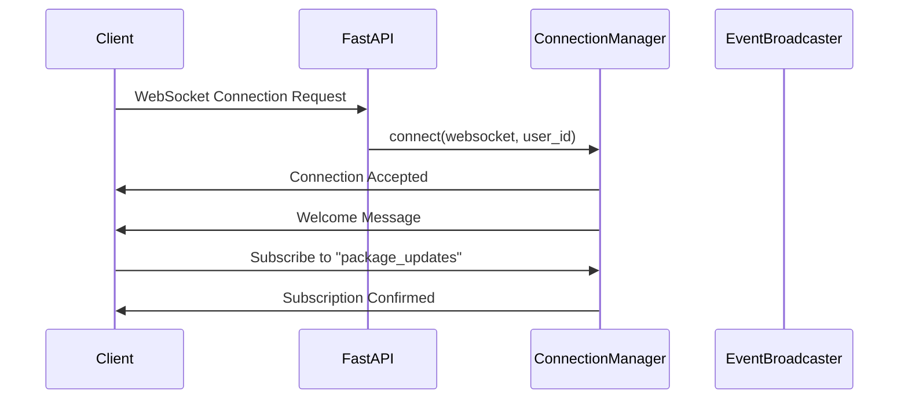
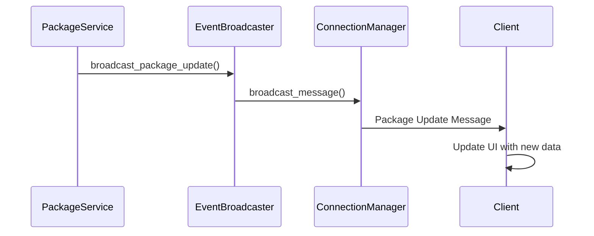
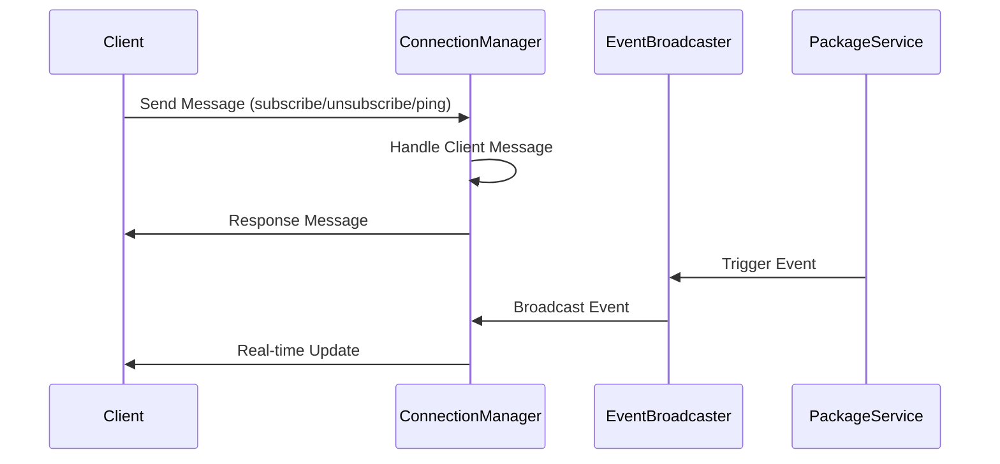

# WebSocket Implementation for ClearPathAI

## Overview

This document explains the comprehensive WebSocket implementation for real-time updates and bidirectional communication in the ClearPathAI application.

## Architecture

### Backend Components

1. **WebSocket Schemas** (`backend/app/schemas/websocket.py`)
   - Defines all WebSocket message types and data structures
   - Includes message types for package updates, anomalies, notifications, etc.

2. **Connection Manager** (`backend/app/websocket/connection_manager.py`)
   - Manages WebSocket connections and subscriptions
   - Handles connection lifecycle (connect, disconnect, reconnect)
   - Manages message broadcasting and subscription filtering

3. **Event Broadcaster** (`backend/app/websocket/event_broadcaster.py`)
   - Broadcasts specific events to subscribed clients
   - Integrates with package service for real-time updates
   - Handles different types of events (package updates, anomalies, etc.)

4. **WebSocket Router** (`backend/app/websocket/websocket_router.py`)
   - FastAPI WebSocket endpoints
   - Multiple specialized endpoints for different use cases
   - REST endpoints for WebSocket management

### Frontend Components

1. **WebSocket Hook** (`frontend/hooks/use-websocket.tsx`)
   - React hook for WebSocket functionality
   - Handles connection, reconnection, and message management
   - Provides subscription management

2. **Demo Component** (`frontend/components/websocket-demo.tsx`)
   - Example component showing WebSocket usage
   - Real-time message display and subscription management

## WebSocket Flow

### 1. Connection Establishment



### 2. Real-Time Package Updates



### 3. Bidirectional Communication



## WebSocket Endpoints

### Main Connection Endpoint
- **URL**: `ws://localhost:8000/ws/connect`
- **Purpose**: General WebSocket connection with full functionality
- **Features**: Subscribe/unsubscribe, ping/pong, bidirectional communication

### Specialized Endpoints

1. **Package Updates**: `ws://localhost:8000/ws/packages`
   - Auto-subscribes to package updates
   - Optimized for package tracking

2. **Dashboard**: `ws://localhost:8000/ws/dashboard`
   - Auto-subscribes to metrics and notifications
   - Optimized for dashboard updates

3. **Map Updates**: `ws://localhost:8000/ws/map`
   - Auto-subscribes to map and package updates
   - Optimized for location tracking

4. **Agent Monitoring**: `ws://localhost:8000/ws/agents`
   - Auto-subscribes to agent activity and system health
   - Optimized for agent monitoring

## Message Types

### 1. Package Updates
```json
{
  "type": "package_update",
  "data": {
    "package_id": "uuid",
    "tracking_number": "PKG123456789",
    "status": "in_transit",
    "location": "Chicago Distribution Center",
    "estimated_delivery": "2024-01-16T14:00:00Z",
    "last_scan_time": "2024-01-15T10:30:00Z",
    "carrier": "FedEx"
  },
  "timestamp": "2024-01-15T10:30:00Z"
}
```

### 2. Anomaly Detection
```json
{
  "type": "anomaly_detected",
  "data": {
    "package_id": "uuid",
    "anomaly_type": "delayed_delivery",
    "severity": "high",
    "description": "Package delayed by 4 hours",
    "recommended_action": "reroute_through_alternative_center",
    "confidence_score": 0.87,
    "detected_at": "2024-01-15T10:30:00Z"
  },
  "timestamp": "2024-01-15T10:30:00Z"
}
```

### 3. Dashboard Metrics
```json
{
  "type": "dashboard_metrics",
  "data": {
    "total_packages": 1247,
    "in_transit": 892,
    "delivered": 312,
    "delayed": 43,
    "anomalies": 12,
    "recovery_rate": 0.94,
    "avg_delivery_time": 2.5
  },
  "timestamp": "2024-01-15T10:30:00Z"
}
```

## Subscription Types

- `package_updates` - Real-time package status changes
- `anomalies` - Anomaly detection alerts
- `dashboard_metrics` - Dashboard analytics updates
- `notifications` - General notifications
- `map_updates` - Location and route updates
- `agent_activity` - AI agent monitoring
- `system_health` - System performance monitoring

## Frontend Usage

### Basic Usage
```typescript
import { useWebSocket } from '@/hooks/use-websocket'

function MyComponent() {
  const { isConnected, lastMessage, sendMessage, subscribe } = useWebSocket()
  
  useEffect(() => {
    if (lastMessage?.type === 'package_update') {
      // Handle package update
      console.log('Package updated:', lastMessage.data)
    }
  }, [lastMessage])
  
  const handleSubscribe = () => {
    subscribe('package_updates')
  }
  
  return (
    <div>
      <p>Status: {isConnected ? 'Connected' : 'Disconnected'}</p>
      <button onClick={handleSubscribe}>Subscribe to Updates</button>
    </div>
  )
}
```

### Advanced Usage
```typescript
function PackageTracker() {
  const { lastMessage, subscribe, unsubscribe } = useWebSocket()
  const [packages, setPackages] = useState([])
  
  useEffect(() => {
    // Subscribe to package updates
    subscribe('package_updates')
    
    return () => {
      unsubscribe('package_updates')
    }
  }, [])
  
  useEffect(() => {
    if (lastMessage?.type === 'package_update') {
      setPackages(prev => 
        prev.map(pkg => 
          pkg.id === lastMessage.data.package_id 
            ? { ...pkg, ...lastMessage.data }
            : pkg
        )
      )
    }
  }, [lastMessage])
  
  return (
    <div>
      {packages.map(pkg => (
        <PackageCard key={pkg.id} package={pkg} />
      ))}
    </div>
  )
}
```

## Integration with Package Service

The WebSocket system is integrated with the existing package service:

```python
# When a package is created
def create_package(self, package_data: PackageCreate) -> Package:
    # ... create package logic ...
    
    # Broadcast via WebSocket
    asyncio.create_task(event_broadcaster.broadcast_package_update(
        package_id=str(db_package.id),
        tracking_number=db_package.tracking_number,
        status=db_package.status.value,
        # ... other data ...
    ))
    
    return db_package
```

## Error Handling

### Connection Errors
- Automatic reconnection with exponential backoff
- Maximum reconnection attempts (5)
- Error state management

### Message Errors
- JSON parsing error handling
- Invalid message format handling
- Connection state validation

## Security Considerations

1. **Authentication**: WebSocket connections can be authenticated using tokens
2. **Authorization**: User-specific subscriptions and message filtering
3. **Rate Limiting**: Message rate limiting per connection
4. **Input Validation**: All incoming messages are validated

## Performance Optimizations

1. **Connection Pooling**: Efficient connection management
2. **Message Batching**: Batch similar messages when possible
3. **Subscription Filtering**: Only send relevant messages to subscribers
4. **Ping/Pong**: Keep-alive mechanism to detect dead connections

## Monitoring and Debugging

### WebSocket Status Endpoint
- **GET** `/ws/status` - Get connection statistics
- **GET** `/ws/connections` - Get active connection details

### Logging
- Connection events (connect, disconnect, errors)
- Message broadcasting events
- Subscription changes

## Testing

### Backend Testing
```python
# Test WebSocket connection
async def test_websocket_connection():
    async with websockets.connect("ws://localhost:8000/ws/connect") as websocket:
        # Test connection
        await websocket.send(json.dumps({"type": "ping", "data": {}}))
        response = await websocket.recv()
        assert json.loads(response)["type"] == "pong"
```

### Frontend Testing
```typescript
// Test WebSocket hook
import { renderHook } from '@testing-library/react'
import { useWebSocket } from '@/hooks/use-websocket'

test('should connect to WebSocket', () => {
  const { result } = renderHook(() => useWebSocket())
  expect(result.current.isConnected).toBe(true)
})
```

## Deployment

### Docker Configuration
The WebSocket server is included in the main FastAPI application and doesn't require separate deployment.

### Nginx Configuration
```nginx
location /ws/ {
    proxy_pass http://clearpath_backend;
    proxy_http_version 1.1;
    proxy_set_header Upgrade $http_upgrade;
    proxy_set_header Connection "upgrade";
    # ... other headers ...
}
```

## Future Enhancements

1. **Redis Integration**: For horizontal scaling
2. **Message Persistence**: Store important messages
3. **Advanced Filtering**: More sophisticated subscription filters
4. **Metrics Collection**: WebSocket performance metrics
5. **Load Balancing**: Multiple WebSocket server instances

## Conclusion

This WebSocket implementation provides:
- ✅ Real-time bidirectional communication
- ✅ Efficient connection management
- ✅ Flexible subscription system
- ✅ Integration with existing services
- ✅ Error handling and reconnection
- ✅ Production-ready architecture

The system is designed to scale and can handle thousands of concurrent connections while providing real-time updates for the ClearPathAI logistics platform.
